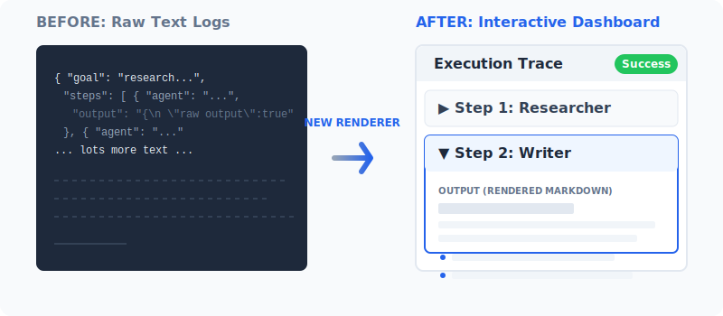

# Changelog

This changelog contains notable updates (past, present, and upcoming) to the **Context Engineering for Multi-Agent Systems** repository.   
🐬 Indicates *new bonus notebooks* to explore. 

## [February 10, 2026]

Upgraded the README with state-of-the art approaches to be educational bridge between the book, *Context Engineering for Multi-Agent Systems* that containts the architecture and code 
and the hands-on repository.

## [February 5, 2026]

**README UPDATE**


[**🛰️ View Software Evolution Timeline has been updated**](https://denis2054.github.io/Context-Engineering-for-Multi-Agent-Systems/media/index.html)

Software Evolution Timeline: Integrated an interactive narrative tracing journey from  Latent Semantic Structures in the 1980s to the 2026 Agentic Era.

APS-Engine_V7 Blueprint added as a link in the timeline: Deployed the 1997 industrial "Physics-Agnostic" Multi-Agent System (MAS) architecture as the cognitive precursor to the Universal Context Engine (Chapter 10).    

Structural Invariance Framework: Added a theoretical breakdown of *P* (Probabilistic) vs. *1-P* (Deterministic) ecosystems, detailing the **algorithmic invariants** that bridge C++ legacy systems with modern Natural Language agents.

**Educational Bridge**: Established cross-linked navigation between modern agentic implementations and industrial MAS heritage.Industrial Heritage Context: Documented the transition from millions of lines of C++ to Software 3.0 emergent reasoning, grounded in strategic corporate AI projects (Aerospace, SCM). 

LinkedIn Integration: Added a direct link to professional milestones and technical breakthroughs for evidence and enhanced credibility for deep-dive research.

### Added
- **AI Discovery Manifest (`llms.txt`):** Deployed a machine-readable `llms.txt` in the root directory. This manifest is optimized for AI agents and search engines to accurately index the Context Engine's capabilities, technical stack, and domain-agnostic architecture.
- **Keyword Optimization:** Updated repository metadata with high-impact keywords: `mcp`, `agentic-rag`, `universal-context-engine`, and `deterministic-ai` to improve visibility within the agentic AI ecosystem.


## [February 2, 2026]

1.Download path tweaked during Quality Control.        

2.Live event announcement:

<hr>
<p align="center">
  <strong>📣 Upcoming Free Live Event — February 2026</strong><br>
  Join the live LinkedIn session on Context Engineering and Multi‑Agent Systems.<br>
  <a href="https://www.linkedin.com/posts/denis-rothman_ai-agenticera-contextengineering-activity-7424026873652850688-eXw8?utm_source=share&utm_medium=member_desktop&rcm=ACoAAAkgWIQBjSA0tmThRb2WkI7foehq89Q4-nA">
    👉 Click here to view the event on LinkedIn
  </a>
</p>
<hr>


## [January 25, 2026]

### Tenacity update

Tenacity, a Python library that provides flexible retry logic for handling transient errors, is part of Google Colab's environment.
Google Colab upgraded its runtime to Tenacity with >=9.0.0, which introduces breaking changes compared to the 8.x series.
The `.ipynb` notebooks and `utlils.py` were updated to ensure compatibility with Tenacity.

## [January 24, 2026 release]
### 🐬New **Sovereign Universal Context Engine:**

The repository now includes `Chapter10/Universal_Context_Engine.ipynb`(batch processing) `Chapter10/Universal_Context_Engine_UI.ipynb`(interactive sessions) that demonstrate the Glass-Box architecture's domain-agnostic capabilities:

* **Universal Architecture:** Runs both Legal and Marketing use cases using the exact same code base, proving that the engine contains zero business rules and relies entirely on retrieved Context and Control Deck instructions.
  
* **Sovereign Solution:** Utilizes High-Fidelity RAG for verifiable accuracy and fully controlled agents, eliminating black-box unpredictability.
  
* **Dual-Domain Support:** Instructions added for appending Marketing data to the Legal index (`clear_index=False`) to create a unified knowledge base.
  
* **Token Analytics Upgrade:**
The `engine.py` core and the dashboard rendering logic have been upgraded to provide rigorous transparency into token usage.
* **Token Tracking:** The Render and Trace Dashboard now explicitly displays **Input Tokens**, **Output Tokens**, and the **Difference** for each step.
  
* **Cost-Efficiency Visibility:** Allows users to immediately gauge the verbosity and cost implications of the model's reasoning process during execution.

* **IPython Interface** in the `Chapter10/Universal_Context_Engine_UI.ipynb`(interactive sessions) version

Building upon the foundational logic established in the standard Universal Context Engine, this version introduces an evolved IPython-based Control Deck with a drop-down menu containing multi-domain preset goals. While the original iteration relies on sequential cell execution and manual variable configuration to transition between Legal and Marketing domains, this notebook implements a dynamic user interface powered by ipywidgets. This evolution streamlines the orchestration process by centralizing goal selection, real-time input editing, and moderation guardrails into a single interactive dashboard, providing a more intuitive and efficient experience for managing complex multi-agent workflows.


* **Commons upgrade**
  
The Python dependencies are now in `commons/engine/` in the `Universal_Context_Engine_UI.ipynb` to facilitate a deployment to your environment:

```python
!curl -Lf https://raw.githubusercontent.com/Denis2054/Context-Engineering/main/commons/engine/utils.py --output utils.py
!curl -Lf https://raw.githubusercontent.com/Denis2054/Context-Engineering/main/commons/engine/helpers.py --output helpers.py
!curl -Lf https://raw.githubusercontent.com/Denis2054/Context-Engineering/main/commons/engine/agents.py --output agents.py
!curl -Lf https://raw.githubusercontent.com/Denis2054/Context-Engineering/main/commons/engine/registry.py --output registry.py
!curl -Lf https://raw.githubusercontent.com/Denis2054/Context-Engineering/main/commons/engine/engine.py --output engine.py
```

You can thus deploy the `Universal_Context_Engine_UI.ipynb` and the `commons/engine` content to your environment.

You can also try using the new engine and engine agents, which allow wider RAG retrievals (`k=15`) and a more flexible execution engine.

```python
!curl -Lf https://raw.githubusercontent.com/Denis2054/Context-Engineering/main/commons/engine/utils.py --output utils.py
!curl -Lf https://raw.githubusercontent.com/Denis2054/Context-Engineering/main/commons/engine/helpers.py --output helpers.py
!curl -Lf https://raw.githubusercontent.com/Denis2054/Context-Engineering/main/commons/engine/agents_k15.py --output agents.py
!curl -Lf https://raw.githubusercontent.com/Denis2054/Context-Engineering/main/commons/engine/registry.py --output registry.py
!curl -Lf https://raw.githubusercontent.com/Denis2054/Context-Engineering/main/commons/engine/engine_k15.py --output engine.py
```
*Note* that though the agents and engine files have a `_k15` suffix, they are imported under their agents.py and engine.py names.

## [January 17, 2026 note]

Google Colab comes pre-installed with a library called `google-adk`that is used for Android development integration which requirements may produce a dependency conflict with the libraries installed in this repository. 
You can ignore this error and proceed to the next cell of the installation section of the notebooks. 

​This notebooks in this repository do not use `google-adk` so a dependency conflict will not affect the Context Engine. 

## [January 2, 2026 release]
### Upgrade Status from OpenAI API GPT-5.1 to GPT-5.2 after evaluation  
The repository has already been upgraded to GPT-5.1, which has improved speed and quality (see November 18, 2025, upgrades).
Some notebooks were running well with GPT-5, and GPT-5.1 added no significant value.
After evaluating GPT-5.2 in the context of this repository with some notebooks such as `Chapter01/Use_Case.ipynb.ipynb`, it appeared that GPT-5.2 did not provide sufficient evidence
of significant improvement over the GPT-5.1 upgrade for latency in the complex chapter-code.    
*Final assessment* 
- GPT-5 works fine for straightforward tasks such as embedding.
- GPT-5.1 significantly improves latency for complex notebooks.
- GPT-5.2 was evaluated. It provides some improvements, but it is not significant for this repository.

### Upgrade
**Execution Visualization:** Updated `execute_and_display` in `Marketing_Assistant.ipynb` and `Legal_assistant_Explorer.ipynb` to utilize the new HTML dashboard renderer instead of standard print statements.
- **Interactive Trace Dashboard:** Introduced `render_trace_dashboard` to visually render the Context Engine's execution trace.
    - Replaces raw text logs with a clean, CSS-styled HTML dashboard.
    - Features collapsible steps, syntax-highlighted JSON, and status badges.
    - Implemented in `Chapter08/Legal_assistant_Explorer.ipynb` and `Chapter09/Marketing_Assistant.ipynb`.


### Upgrade
`Data_Ingestion_Marketing.ipynb` has been updated to clear or append data.
In section *2.Initialize Clients*, we can clear the index of its content or append it:
```python
clear_index = True # If True, empties the index namespaces. If False, appends to the existing index.
```

## [November 18, 2025]

### List of notebooks upgraded    
`Chapter01/Use_Case.ipynb`    
`Chapter01MAS_MCP_control.ipynb`
`Chapter03/Context_Aware_MAS.ipynb`     
`Chapter05/Context_Engine_MAS_MCP.ipynb`     
`Chapter05/Context_Engine_Pre_Production.ipynb`    
`Chapter06/Context_Engine_Content_Reduction.ipynb`    
`Chapter07/NASA_Research_Assistant_and_Retrocompatibility.ipynb`        

### List of notebooks upgraded and fixed 1 and 2     
`Chapter04/Context_Engine.ipynb` (fixed 1)    
`Chapter08/Legal_assistant_Explorer.ipynb` (fixed 2)    
`Chapter09/Marketing_Assistant.ipynb`  (fixed 2

### Upgraded
**OpenAI API GPT-5.1:** 

GPT-5 has been upgraded to GPT-5.1, which improves API response time.
OpenAI API library has been upgraded to 2.8.1 in `commons/utils.py,` which is now the reference installation file for all notebooks in the repository.

OpenAI provided the following release notes that address, among other issues, latency for reasoning, which is important for MAS programs such as MAS Context Engine.

"We’ve released GPT-5.1 in the API, the next model in the GPT-5 series built to balance intelligence and speed across agentic and coding tasks.
Here’s what’s new in GPT 5.1:

Adaptive reasoning that adjusts thinking time by task complexity—spending more time on complex tasks and responding faster on simple tasks.
New reasoning_effort = 'none' mode, offers a fast, accurate non-reasoning path for **latency sensitive use cases**. *Defaults to none when unspecified.*
Extended prompt caching with retention up to 24 hours to reduce latency for long-running conversations.
Upgrades to coding: more communicative, highly steerable, better code quality, improved frontend UI generation.
New tools: apply_patch (structured diffs) and shell (controlled local CLI).
Pricing: Same pricing and rate limits as GPT-5."

### Fixed 1

Resolved an issue in the Context Engine where the Planner failed to parse valid JSON plans. Added support for the steps key in the LLM response schema to prevent execution errors.

### Fixed 2
- **Moderation API Type:** Resolved a critical formatting issue in `Marketing_Assistant.ipynb` (Cell 4) where the OpenAI Moderation API failed with `Error code: 400` when agents returned structured data (dictionaries or lists). Added logic to serialize these outputs into strings before submission.

### Added
- **JSON Support:** Added `import json` to the execution cell to support data serialization.

### Changed
- **Output Rendering:** Updated the `execute_and_display` function to detect JSON outputs and render them as formatted Markdown code blocks for improved readability in the notebook.

## [November 7, 2025]

Repository made public.
